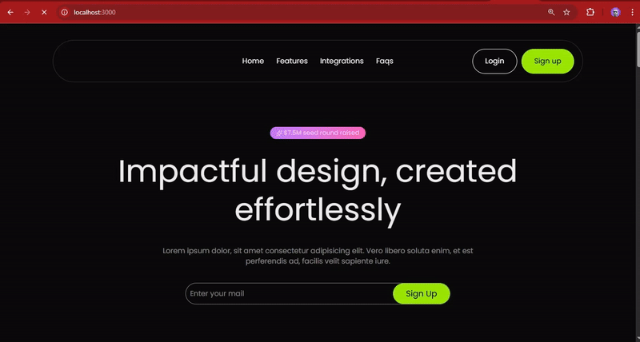

# 🚀 LaunchPad: Layer SaaS Template

**LaunchPad: Layer** is a high-performance, developer-first landing page template built with **Next.js 15**, **Tailwind CSS**, and **Framer Motion**. This template is designed to be fully customizable via a single configuration file—making it perfect for developers and non-coders alike.

---

## 📺 Video Showcase
See how the "Layer" template looks and works in action:

<details>
  <summary><b>🎬 View Live Demo</b></summary>
  <br>
  
</details>

---

## ✨ Features
- ⚡ **Next.js 15** - Fast, modern, and SEO-friendly.
- 🎨 **Data-Driven UI** - Update your entire site from one file (`siteConfig.ts`).
- 📱 **Fully Responsive** - Looks beautiful on mobile, tablet, and desktop.
- 🎭 **Smooth Animations** - Powered by Framer Motion for a premium feel.
- 🧩 **Lucide Icons** - Easily swap icons using simple text names.

---

## 🛠️ Installation

1. **Clone the repo**
   ```bash
   git clone [https://github.com/thedevbuilder/LaunchPad-Template-Layers.git](https://github.com/thedevbuilder/LaunchPad-Template-Layers.git)